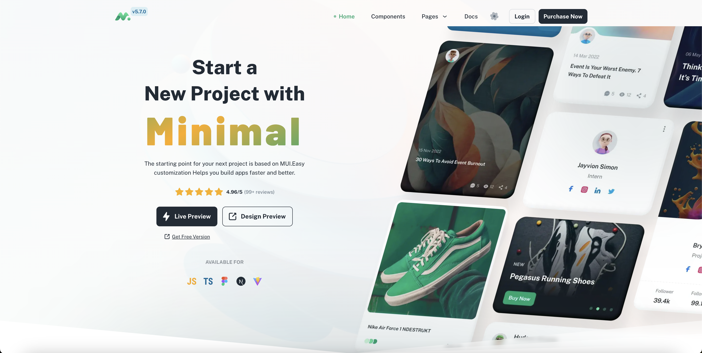

<<<<<<< Updated upstream
# Technologies

- NextJS
- Typescript
- MaterialUI

---
=======

Demo: [minimal.cc](https://minimals.cc/)
>>>>>>> Stashed changes

## NODE.JS

- Node 16.x || 18.x

## USING YARN (Recommend)

- yarn install
- yarn dev

## USING NPM

- npm i OR npm i --legacy-peer-deps
- npm run dev

